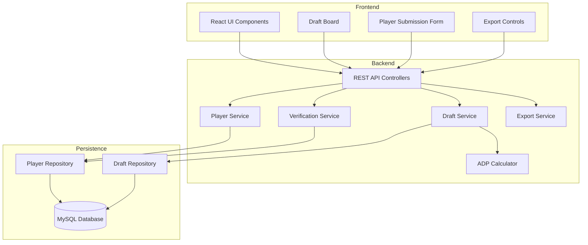

# Design Document: Devy BigBoard Improvements

## Overview

This design enhances the Devy BigBoard fantasy football draft application with database persistence, player verification workflows, draft sharing capabilities, and improved accessibility. The system maintains a Spring Boot backend with React/TypeScript frontend while adding MySQL integration via Railway.

The architecture follows a layered approach:
- **Persistence Layer**: MySQL database with JPA repositories
- **Service Layer**: Business logic for player management, draft operations, and ADP calculations
- **API Layer**: REST endpoints with comprehensive validation and error handling
- **Frontend Layer**: React components with accessibility features and responsive design

Key design decisions:
- Use JPA/Hibernate for database access (no Flyway/Liquibase per constraints)
- Implement verification as a simple secret-code-based endpoint
- Generate UUIDs server-side for draft identification
- Support multiple export formats through dedicated service classes
- Build accessibility into components from the start

## Architecture

### System Components



### Database Schema


**Players Table**
```sql
CREATE TABLE players (
    id BIGINT AUTO_INCREMENT PRIMARY KEY,
    name VARCHAR(255) NOT NULL,
    position VARCHAR(50) NOT NULL,
    team VARCHAR(255),
    college VARCHAR(255),
    verified BOOLEAN DEFAULT FALSE,
    total_selections INT DEFAULT 0,
    sum_draft_positions BIGINT DEFAULT 0,
    average_draft_position DECIMAL(10,2),
    created_at TIMESTAMP DEFAULT CURRENT_TIMESTAMP,
    updated_at TIMESTAMP DEFAULT CURRENT_TIMESTAMP ON UPDATE CURRENT_TIMESTAMP,
    INDEX idx_verified (verified),
    INDEX idx_position (position),
    INDEX idx_adp (average_draft_position)
);
```

**Drafts Table**
```sql
CREATE TABLE drafts (
    id BIGINT AUTO_INCREMENT PRIMARY KEY,
    uuid VARCHAR(36) UNIQUE NOT NULL,
    draft_name VARCHAR(255),
    status VARCHAR(50) DEFAULT 'completed',
    participant_count INT DEFAULT 1,
    created_at TIMESTAMP DEFAULT CURRENT_TIMESTAMP,
    completed_at TIMESTAMP,
    INDEX idx_uuid (uuid),
    INDEX idx_created_at (created_at)
);
```

**Draft Picks Table**
```sql
CREATE TABLE draft_picks (
    id BIGINT AUTO_INCREMENT PRIMARY KEY,
    draft_id BIGINT NOT NULL,
    player_id BIGINT NOT NULL,
    pick_number INT NOT NULL,
    picked_at TIMESTAMP DEFAULT CURRENT_TIMESTAMP,
    FOREIGN KEY (draft_id) REFERENCES drafts(id) ON DELETE CASCADE,
    FOREIGN KEY (player_id) REFERENCES players(id),
    INDEX idx_draft_id (draft_id),
    INDEX idx_player_id (player_id)
);
```

### Technology Stack

- **Backend**: Spring Boot 3.4.2, Java 21, Spring Data JPA, MySQL Connector
- **Frontend**: React 18, TypeScript, Webpack 5
- **Database**: MySQL 8.0 on Railway
- **Export Libraries**: Apache POI (PDF), Jackson (JSON), OpenCSV (CSV)
- **Deployment**: Railway with Nixpacks

## Components and Interfaces

### Backend Components

#### 1. Player Entity
```java
@Entity
@Table(name = "players")
public class Player {
    @Id
    @GeneratedValue(strategy = GenerationType.IDENTITY)
    private Long id;
    
    @Column(nullable = false)
    private String name;
    
    @Column(nullable = false)
    private String position;
    
    private String team;
    private String college;
    
    @Column(nullable = false)
    private Boolean verified = false;
    
    private Integer totalSelections = 0;
    private Long sumDraftPositions = 0L;
    private BigDecimal averageDraftPosition;
    
    @CreatedDate
    private LocalDateTime createdAt;
    
    @LastModifiedDate
    private LocalDateTime updatedAt;
    
    // Getters, setters, constructors
}
```

#### 2. Draft Entity
```java
@Entity
@Table(name = "drafts")
public class Draft {
    @Id
    @GeneratedValue(strategy = GenerationType.IDENTITY)
    private Long id;
    
    @Column(unique = true, nullable = false)
    private String uuid;
    
    private String draftName;
    private String status;
    private Integer participantCount;
    
    @OneToMany(mappedBy = "draft", cascade = CascadeType.ALL)
    private List<DraftPick> picks;
    
    @CreatedDate
    private LocalDateTime createdAt;
    
    private LocalDateTime completedAt;
    
    // Getters, setters, constructors
}
```

#### 3. DraftPick Entity
```java
@Entity
@Table(name = "draft_picks")
public class DraftPick {
    @Id
    @GeneratedValue(strategy = GenerationType.IDENTITY)
    private Long id;
    
    @ManyToOne
    @JoinColumn(name = "draft_id", nullable = false)
    private Draft draft;
    
    @ManyToOne
    @JoinColumn(name = "player_id", nullable = false)
    private Player player;
    
    @Column(nullable = false)
    private Integer pickNumber;
    
    private LocalDateTime pickedAt;
    
    // Getters, setters, constructors
}
```


#### 4. PlayerService
```java
@Service
public class PlayerService {
    private final PlayerRepository playerRepository;
    
    public Player createPlayer(PlayerDTO playerDTO) {
        validatePlayerData(playerDTO);
        Player player = new Player();
        // Map DTO to entity
        player.setVerified(false);
        return playerRepository.save(player);
    }
    
    public List<Player> getVerifiedPlayers() {
        return playerRepository.findByVerifiedTrue();
    }
    
    public Player verifyPlayer(Long playerId) {
        Player player = playerRepository.findById(playerId)
            .orElseThrow(() -> new PlayerNotFoundException(playerId));
        player.setVerified(true);
        return playerRepository.save(player);
    }
    
    public void updateADP(Long playerId, int pickNumber) {
        Player player = playerRepository.findById(playerId)
            .orElseThrow(() -> new PlayerNotFoundException(playerId));
        
        player.setTotalSelections(player.getTotalSelections() + 1);
        player.setSumDraftPositions(player.getSumDraftPositions() + pickNumber);
        
        BigDecimal adp = BigDecimal.valueOf(player.getSumDraftPositions())
            .divide(BigDecimal.valueOf(player.getTotalSelections()), 2, RoundingMode.HALF_UP);
        player.setAverageDraftPosition(adp);
        
        playerRepository.save(player);
    }
    
    private void validatePlayerData(PlayerDTO dto) {
        if (dto.getName() == null || dto.getName().trim().isEmpty()) {
            throw new ValidationException("Player name is required");
        }
        if (dto.getPosition() == null || dto.getPosition().trim().isEmpty()) {
            throw new ValidationException("Player position is required");
        }
        // Additional validation
    }
}
```

#### 5. DraftService
```java
@Service
public class DraftService {
    private final DraftRepository draftRepository;
    private final PlayerService playerService;
    
    @Transactional
    public Draft saveDraft(DraftDTO draftDTO) {
        Draft draft = new Draft();
        draft.setUuid(UUID.randomUUID().toString());
        draft.setDraftName(draftDTO.getDraftName());
        draft.setStatus("completed");
        draft.setParticipantCount(draftDTO.getParticipantCount());
        draft.setCompletedAt(LocalDateTime.now());
        
        List<DraftPick> picks = new ArrayList<>();
        for (PickDTO pickDTO : draftDTO.getPicks()) {
            DraftPick pick = new DraftPick();
            pick.setDraft(draft);
            pick.setPlayer(playerService.getPlayerById(pickDTO.getPlayerId()));
            pick.setPickNumber(pickDTO.getPickNumber());
            pick.setPickedAt(LocalDateTime.now());
            picks.add(pick);
            
            // Update ADP for each picked player
            playerService.updateADP(pickDTO.getPlayerId(), pickDTO.getPickNumber());
        }
        
        draft.setPicks(picks);
        return draftRepository.save(draft);
    }
    
    public Draft getDraftByUuid(String uuid) {
        return draftRepository.findByUuid(uuid)
            .orElseThrow(() -> new DraftNotFoundException(uuid));
    }
    
    public List<Draft> getRecentDrafts(int limit) {
        return draftRepository.findTopNByOrderByCreatedAtDesc(limit);
    }
}
```

#### 6. VerificationService
```java
@Service
public class VerificationService {
    @Value("${app.verification.secret}")
    private String verificationSecret;
    
    private final PlayerService playerService;
    
    public Player verifyPlayer(Long playerId, String providedSecret) {
        if (!verificationSecret.equals(providedSecret)) {
            throw new UnauthorizedException("Invalid verification code");
        }
        return playerService.verifyPlayer(playerId);
    }
}
```

#### 7. ExportService
```java
@Service
public class ExportService {
    
    public byte[] exportToCSV(Draft draft) {
        StringWriter writer = new StringWriter();
        CSVWriter csvWriter = new CSVWriter(writer);
        
        // Write header
        csvWriter.writeNext(new String[]{"Pick", "Player", "Position", "Team"});
        
        // Write picks
        for (DraftPick pick : draft.getPicks()) {
            csvWriter.writeNext(new String[]{
                String.valueOf(pick.getPickNumber()),
                pick.getPlayer().getName(),
                pick.getPlayer().getPosition(),
                pick.getPlayer().getTeam()
            });
        }
        
        return writer.toString().getBytes(StandardCharsets.UTF_8);
    }
    
    public String exportToJSON(Draft draft) {
        ObjectMapper mapper = new ObjectMapper();
        DraftExportDTO exportDTO = mapDraftToExportDTO(draft);
        return mapper.writeValueAsString(exportDTO);
    }
    
    public byte[] exportToPDF(Draft draft) {
        // Use Apache POI or similar library to generate PDF
        // Format draft results in a printable layout
        // Return PDF bytes
    }
}
```


#### 8. REST API Controllers

**PlayerController**
```java
@RestController
@RequestMapping("/api/players")
public class PlayerController {
    private final PlayerService playerService;
    
    @PostMapping
    public ResponseEntity<PlayerResponse> createPlayer(@Valid @RequestBody PlayerDTO playerDTO) {
        try {
            Player player = playerService.createPlayer(playerDTO);
            return ResponseEntity.status(HttpStatus.CREATED)
                .body(new PlayerResponse(player));
        } catch (ValidationException e) {
            throw new BadRequestException(e.getMessage());
        }
    }
    
    @GetMapping
    public ResponseEntity<List<PlayerResponse>> getVerifiedPlayers() {
        List<Player> players = playerService.getVerifiedPlayers();
        return ResponseEntity.ok(players.stream()
            .map(PlayerResponse::new)
            .collect(Collectors.toList()));
    }
    
    @PostMapping("/{id}/verify")
    public ResponseEntity<PlayerResponse> verifyPlayer(
            @PathVariable Long id,
            @RequestParam String code) {
        try {
            Player player = verificationService.verifyPlayer(id, code);
            return ResponseEntity.ok(new PlayerResponse(player));
        } catch (UnauthorizedException e) {
            throw new ForbiddenException("Invalid verification code");
        } catch (PlayerNotFoundException e) {
            throw new NotFoundException("Player not found");
        }
    }
}
```

**DraftController**
```java
@RestController
@RequestMapping("/api/drafts")
public class DraftController {
    private final DraftService draftService;
    private final ExportService exportService;
    
    @PostMapping
    public ResponseEntity<DraftResponse> saveDraft(@Valid @RequestBody DraftDTO draftDTO) {
        Draft draft = draftService.saveDraft(draftDTO);
        return ResponseEntity.status(HttpStatus.CREATED)
            .body(new DraftResponse(draft));
    }
    
    @GetMapping("/{uuid}")
    public ResponseEntity<DraftResponse> getDraft(@PathVariable String uuid) {
        try {
            Draft draft = draftService.getDraftByUuid(uuid);
            return ResponseEntity.ok(new DraftResponse(draft));
        } catch (DraftNotFoundException e) {
            throw new NotFoundException("Draft not found");
        }
    }
    
    @GetMapping("/{uuid}/export/csv")
    public ResponseEntity<byte[]> exportCSV(@PathVariable String uuid) {
        Draft draft = draftService.getDraftByUuid(uuid);
        byte[] csv = exportService.exportToCSV(draft);
        
        return ResponseEntity.ok()
            .header(HttpHeaders.CONTENT_DISPOSITION, "attachment; filename=draft-" + uuid + ".csv")
            .contentType(MediaType.parseMediaType("text/csv"))
            .body(csv);
    }
    
    @GetMapping("/{uuid}/export/json")
    public ResponseEntity<String> exportJSON(@PathVariable String uuid) {
        Draft draft = draftService.getDraftByUuid(uuid);
        String json = exportService.exportToJSON(draft);
        
        return ResponseEntity.ok()
            .contentType(MediaType.APPLICATION_JSON)
            .body(json);
    }
    
    @GetMapping("/{uuid}/export/pdf")
    public ResponseEntity<byte[]> exportPDF(@PathVariable String uuid) {
        Draft draft = draftService.getDraftByUuid(uuid);
        byte[] pdf = exportService.exportToPDF(draft);
        
        return ResponseEntity.ok()
            .header(HttpHeaders.CONTENT_DISPOSITION, "attachment; filename=draft-" + uuid + ".pdf")
            .contentType(MediaType.APPLICATION_PDF)
            .body(pdf);
    }
}
```

### Frontend Components

#### 1. PlayerSubmissionForm Component
```typescript
interface PlayerSubmissionFormProps {
    onSubmit: (player: PlayerSubmission) => Promise<void>;
}

export const PlayerSubmissionForm: React.FC<PlayerSubmissionFormProps> = ({ onSubmit }) => {
    const [formData, setFormData] = useState<PlayerSubmission>({
        name: '',
        position: '',
        team: '',
        college: ''
    });
    const [errors, setErrors] = useState<Record<string, string>>({});
    const [isSubmitting, setIsSubmitting] = useState(false);
    
    const handleSubmit = async (e: React.FormEvent) => {
        e.preventDefault();
        
        // Validate
        const validationErrors = validatePlayerData(formData);
        if (Object.keys(validationErrors).length > 0) {
            setErrors(validationErrors);
            return;
        }
        
        setIsSubmitting(true);
        try {
            await onSubmit(formData);
            // Reset form
            setFormData({ name: '', position: '', team: '', college: '' });
            setErrors({});
        } catch (error) {
            setErrors({ submit: error.message });
        } finally {
            setIsSubmitting(false);
        }
    };
    
    return (
        <form onSubmit={handleSubmit} aria-label="Submit new player">
            <div>
                <label htmlFor="player-name">Player Name *</label>
                <input
                    id="player-name"
                    type="text"
                    value={formData.name}
                    onChange={(e) => setFormData({ ...formData, name: e.target.value })}
                    aria-required="true"
                    aria-invalid={!!errors.name}
                    aria-describedby={errors.name ? "name-error" : undefined}
                />
                {errors.name && <span id="name-error" role="alert">{errors.name}</span>}
            </div>
            
            {/* Similar fields for position, team, college */}
            
            <button 
                type="submit" 
                disabled={isSubmitting}
                aria-busy={isSubmitting}
            >
                {isSubmitting ? 'Submitting...' : 'Submit Player'}
            </button>
        </form>
    );
};
```


#### 2. DraftBoard Component (Enhanced)
```typescript
interface DraftBoardProps {
    players: Player[];
    onDraftComplete: (draft: DraftData) => Promise<void>;
}

export const DraftBoard: React.FC<DraftBoardProps> = ({ players, onDraftComplete }) => {
    const [selectedPlayers, setSelectedPlayers] = useState<DraftPick[]>([]);
    const [isMobile, setIsMobile] = useState(window.innerWidth < 768);
    
    useEffect(() => {
        const handleResize = () => setIsMobile(window.innerWidth < 768);
        window.addEventListener('resize', handleResize);
        return () => window.removeEventListener('resize', handleResize);
    }, []);
    
    const handleDragStart = (e: React.DragEvent, player: Player) => {
        e.dataTransfer.setData('playerId', player.id.toString());
        e.currentTarget.classList.add('dragging');
    };
    
    const handleDrop = (e: React.DragEvent, pickNumber: number) => {
        e.preventDefault();
        const playerId = e.dataTransfer.getData('playerId');
        const player = players.find(p => p.id.toString() === playerId);
        
        if (player) {
            setSelectedPlayers([...selectedPlayers, { player, pickNumber }]);
        }
    };
    
    const handleKeyboardSelect = (player: Player, pickNumber: number) => {
        setSelectedPlayers([...selectedPlayers, { player, pickNumber }]);
    };
    
    return (
        <div 
            className={`draft-board ${isMobile ? 'mobile' : 'desktop'}`}
            role="application"
            aria-label="Draft board"
        >
            <div className="player-pool" role="list" aria-label="Available players">
                {players.map(player => (
                    <div
                        key={player.id}
                        draggable
                        onDragStart={(e) => handleDragStart(e, player)}
                        role="listitem"
                        tabIndex={0}
                        aria-label={`${player.name}, ${player.position}, ${player.team}`}
                        onKeyDown={(e) => {
                            if (e.key === 'Enter' || e.key === ' ') {
                                handleKeyboardSelect(player, selectedPlayers.length + 1);
                            }
                        }}
                    >
                        <span>{player.name}</span>
                        <span>{player.position}</span>
                        <span>{player.team}</span>
                        {player.averageDraftPosition && (
                            <span aria-label={`Average draft position ${player.averageDraftPosition}`}>
                                ADP: {player.averageDraftPosition}
                            </span>
                        )}
                    </div>
                ))}
            </div>
            
            <div className="draft-picks" role="list" aria-label="Draft picks">
                {Array.from({ length: 12 }).map((_, index) => (
                    <div
                        key={index}
                        className="pick-slot"
                        onDrop={(e) => handleDrop(e, index + 1)}
                        onDragOver={(e) => e.preventDefault()}
                        role="listitem"
                        aria-label={`Pick ${index + 1}`}
                    >
                        {selectedPlayers.find(p => p.pickNumber === index + 1)?.player.name || 
                         `Pick ${index + 1}`}
                    </div>
                ))}
            </div>
        </div>
    );
};
```

#### 3. ExportControls Component
```typescript
interface ExportControlsProps {
    draftUuid: string;
}

export const ExportControls: React.FC<ExportControlsProps> = ({ draftUuid }) => {
    const [isExporting, setIsExporting] = useState(false);
    const [error, setError] = useState<string | null>(null);
    
    const handleExport = async (format: 'csv' | 'json' | 'pdf') => {
        setIsExporting(true);
        setError(null);
        
        try {
            const response = await fetch(`/api/drafts/${draftUuid}/export/${format}`);
            
            if (!response.ok) {
                throw new Error(`Export failed: ${response.statusText}`);
            }
            
            const blob = await response.blob();
            const url = window.URL.createObjectURL(blob);
            const a = document.createElement('a');
            a.href = url;
            a.download = `draft-${draftUuid}.${format}`;
            a.click();
            window.URL.revokeObjectURL(url);
        } catch (err) {
            setError(err.message);
        } finally {
            setIsExporting(false);
        }
    };
    
    return (
        <div className="export-controls" role="group" aria-label="Export options">
            <button
                onClick={() => handleExport('csv')}
                disabled={isExporting}
                aria-label="Export as CSV"
            >
                Export CSV
            </button>
            <button
                onClick={() => handleExport('json')}
                disabled={isExporting}
                aria-label="Export as JSON"
            >
                Export JSON
            </button>
            <button
                onClick={() => handleExport('pdf')}
                disabled={isExporting}
                aria-label="Export as PDF"
            >
                Export PDF
            </button>
            
            {error && (
                <div role="alert" className="error-message">
                    {error}
                </div>
            )}
        </div>
    );
};
```

#### 4. ShareableLink Component
```typescript
interface ShareableLinkProps {
    draftUuid: string;
}

export const ShareableLink: React.FC<ShareableLinkProps> = ({ draftUuid }) => {
    const [copied, setCopied] = useState(false);
    const shareUrl = `${window.location.origin}/drafts/${draftUuid}`;
    
    const handleCopy = async () => {
        try {
            await navigator.clipboard.writeText(shareUrl);
            setCopied(true);
            setTimeout(() => setCopied(false), 2000);
        } catch (err) {
            console.error('Failed to copy:', err);
        }
    };
    
    return (
        <div className="shareable-link" role="region" aria-label="Shareable link">
            <label htmlFor="share-url">Share this draft:</label>
            <input
                id="share-url"
                type="text"
                value={shareUrl}
                readOnly
                aria-label="Draft share URL"
            />
            <button
                onClick={handleCopy}
                aria-label={copied ? "Link copied" : "Copy link to clipboard"}
            >
                {copied ? 'Copied!' : 'Copy Link'}
            </button>
        </div>
    );
};
```

## Data Models

### DTOs (Data Transfer Objects)

**PlayerDTO**
```java
public class PlayerDTO {
    @NotBlank(message = "Player name is required")
    @Size(max = 255, message = "Name must not exceed 255 characters")
    private String name;
    
    @NotBlank(message = "Position is required")
    @Size(max = 50, message = "Position must not exceed 50 characters")
    private String position;
    
    @Size(max = 255, message = "Team must not exceed 255 characters")
    private String team;
    
    @Size(max = 255, message = "College must not exceed 255 characters")
    private String college;
    
    // Getters, setters
}
```

**DraftDTO**
```java
public class DraftDTO {
    @Size(max = 255, message = "Draft name must not exceed 255 characters")
    private String draftName;
    
    @Min(value = 1, message = "Participant count must be at least 1")
    private Integer participantCount;
    
    @NotEmpty(message = "Draft must contain at least one pick")
    private List<PickDTO> picks;
    
    // Getters, setters
}
```

**PickDTO**
```java
public class PickDTO {
    @NotNull(message = "Player ID is required")
    private Long playerId;
    
    @NotNull(message = "Pick number is required")
    @Min(value = 1, message = "Pick number must be at least 1")
    private Integer pickNumber;
    
    // Getters, setters
}
```

### TypeScript Interfaces

```typescript
interface Player {
    id: number;
    name: string;
    position: string;
    team?: string;
    college?: string;
    verified: boolean;
    averageDraftPosition?: number;
}

interface DraftPick {
    player: Player;
    pickNumber: number;
}

interface Draft {
    uuid: string;
    draftName?: string;
    participantCount: number;
    picks: DraftPick[];
    createdAt: string;
    completedAt?: string;
}

interface PlayerSubmission {
    name: string;
    position: string;
    team?: string;
    college?: string;
}

interface ApiError {
    timestamp: string;
    status: number;
    error: string;
    message: string;
    path: string;
}
```


## Correctness Properties

*A property is a characteristic or behavior that should hold true across all valid executions of a system—essentially, a formal statement about what the system should do. Properties serve as the bridge between human-readable specifications and machine-verifiable correctness guarantees.*

### Property 1: ADP Calculation Accuracy

*For any* draft with player selections, when the draft is saved, the Average Draft Position for each selected player should equal the sum of all their draft positions divided by their total number of selections across all historical drafts.

**Validates: Requirements 1.4, 4.3**

### Property 2: Unverified Player Default State

*For any* player submission with valid required fields, the created player should have verification status set to false.

**Validates: Requirements 2.1**

### Property 3: Verified Player Pool Filtering

*For any* request to retrieve the player pool, all returned players should have verification status equal to true, and no players with verification status false should be included.

**Validates: Requirements 2.2**

### Property 4: Required Field Validation

*For any* player submission missing one or more required fields (name, position), the system should reject the submission and return HTTP 400 with error messages identifying the missing fields.

**Validates: Requirements 2.3, 2.4**

### Property 5: Verification State Transition

*For any* unverified player, when the verification endpoint is called with the correct secret code, the player's verification status should transition from false to true.

**Validates: Requirements 3.2, 3.5**

### Property 6: Verification Authentication

*For any* verification request with an incorrect secret code, the system should return HTTP 403 regardless of whether the player ID exists.

**Validates: Requirements 3.3**

### Property 7: Draft UUID Uniqueness

*For any* two drafts saved to the system, their UUIDs should be distinct and conform to valid UUID format (RFC 4122).

**Validates: Requirements 4.1**

### Property 8: Draft Persistence Round-Trip

*For any* draft that is saved to the database, retrieving that draft by its UUID should return data equivalent to the original draft (same picks, pick numbers, player IDs, and metadata).

**Validates: Requirements 4.2, 4.4**

### Property 9: CSV Export Completeness

*For any* draft, the generated CSV export should contain exactly one row per pick, with each row including pick number, player name, position, and team in the correct columns.

**Validates: Requirements 5.1**

### Property 10: JSON Export Completeness

*For any* draft, the generated JSON export should be valid JSON and contain all draft fields including UUID, draft name, participant count, picks array, and timestamps.

**Validates: Requirements 5.2**

### Property 11: Export Content-Type Headers

*For any* export request (CSV, JSON, or PDF), the HTTP response should include a Content-Type header matching the requested format (text/csv, application/json, or application/pdf respectively).

**Validates: Requirements 5.4**

### Property 12: Shareable URL Format

*For any* saved draft, the returned shareable URL should contain the draft's UUID and be a valid, accessible URL path.

**Validates: Requirements 6.1**

### Property 13: Draft Metadata Display

*For any* draft viewed via shareable link, the UI should render all metadata fields including draft name, timestamp, and participant count.

**Validates: Requirements 6.3**

### Property 14: Unauthenticated Draft Access

*For any* valid draft UUID, the retrieval endpoint should return the draft data without requiring authentication headers or credentials.

**Validates: Requirements 6.5**

### Property 15: ARIA Label Presence

*For all* interactive UI elements (buttons, inputs, draggable items, drop zones), each element should have either an aria-label attribute or an associated label element.

**Validates: Requirements 7.1**

### Property 16: Touch Target Minimum Size

*For all* interactive UI elements in the mobile layout, each element should have dimensions of at least 44x44 pixels to meet touch target accessibility guidelines.

**Validates: Requirements 8.5**

### Property 17: Loading State Indication

*For any* API request initiated from the UI, a loading indicator should be visible from the moment the request starts until the response is received or an error occurs.

**Validates: Requirements 9.1**

### Property 18: Error Message Display

*For any* failed API request, the UI should display an error message containing a description of the problem within 100ms of receiving the error response.

**Validates: Requirements 9.2**

### Property 19: Validation Error Highlighting

*For any* form submission with invalid fields, the UI should visually highlight each invalid field and display a field-specific error message adjacent to that field.

**Validates: Requirements 9.3**

### Property 20: Error Response Structure Consistency

*For any* error response from the API (4xx or 5xx status), the response body should be valid JSON containing at minimum: status code, error message, and timestamp fields.

**Validates: Requirements 9.5**

### Property 21: Error Logging Completeness

*For any* exception or error that occurs in the backend, a log entry should be created containing timestamp, error message, stack trace, and request context.

**Validates: Requirements 9.4**

### Property 22: Input Type Validation

*For any* API request, all parameters should be validated against their expected types, and requests with type mismatches should return HTTP 400 with details about the type violation.

**Validates: Requirements 10.1, 10.2**

### Property 23: SQL Injection Prevention

*For any* string input containing SQL injection patterns (e.g., "'; DROP TABLE", "' OR '1'='1"), the system should sanitize the input such that no SQL commands are executed, and the literal string is safely stored or rejected.

**Validates: Requirements 10.3**

### Property 24: Text Field Length Constraints

*For any* text field with a maximum length constraint, inputs exceeding that length should be rejected with HTTP 400 and an error message specifying the maximum allowed length.

**Validates: Requirements 10.4**

### Property 25: Numeric Range Validation

*For any* numeric field (pick numbers, participant counts), values outside the acceptable range (e.g., negative numbers, zero participants) should be rejected with HTTP 400 and an error message specifying the valid range.

**Validates: Requirements 10.5**


## Error Handling

### Backend Error Handling Strategy

**Exception Hierarchy**
```java
// Custom exceptions
public class PlayerNotFoundException extends RuntimeException {
    public PlayerNotFoundException(Long id) {
        super("Player not found with id: " + id);
    }
}

public class DraftNotFoundException extends RuntimeException {
    public DraftNotFoundException(String uuid) {
        super("Draft not found with uuid: " + uuid);
    }
}

public class UnauthorizedException extends RuntimeException {
    public UnauthorizedException(String message) {
        super(message);
    }
}

public class ValidationException extends RuntimeException {
    private Map<String, String> fieldErrors;
    
    public ValidationException(String message) {
        super(message);
    }
    
    public ValidationException(Map<String, String> fieldErrors) {
        this.fieldErrors = fieldErrors;
    }
}
```

**Global Exception Handler**
```java
@RestControllerAdvice
public class GlobalExceptionHandler {
    
    private static final Logger logger = LoggerFactory.getLogger(GlobalExceptionHandler.class);
    
    @ExceptionHandler(PlayerNotFoundException.class)
    public ResponseEntity<ErrorResponse> handlePlayerNotFound(
            PlayerNotFoundException ex, 
            HttpServletRequest request) {
        logger.error("Player not found: {}", ex.getMessage());
        
        ErrorResponse error = new ErrorResponse(
            LocalDateTime.now(),
            HttpStatus.NOT_FOUND.value(),
            "Not Found",
            ex.getMessage(),
            request.getRequestURI()
        );
        
        return ResponseEntity.status(HttpStatus.NOT_FOUND).body(error);
    }
    
    @ExceptionHandler(DraftNotFoundException.class)
    public ResponseEntity<ErrorResponse> handleDraftNotFound(
            DraftNotFoundException ex,
            HttpServletRequest request) {
        logger.error("Draft not found: {}", ex.getMessage());
        
        ErrorResponse error = new ErrorResponse(
            LocalDateTime.now(),
            HttpStatus.NOT_FOUND.value(),
            "Not Found",
            ex.getMessage(),
            request.getRequestURI()
        );
        
        return ResponseEntity.status(HttpStatus.NOT_FOUND).body(error);
    }
    
    @ExceptionHandler(UnauthorizedException.class)
    public ResponseEntity<ErrorResponse> handleUnauthorized(
            UnauthorizedException ex,
            HttpServletRequest request) {
        logger.warn("Unauthorized access attempt: {}", ex.getMessage());
        
        ErrorResponse error = new ErrorResponse(
            LocalDateTime.now(),
            HttpStatus.FORBIDDEN.value(),
            "Forbidden",
            ex.getMessage(),
            request.getRequestURI()
        );
        
        return ResponseEntity.status(HttpStatus.FORBIDDEN).body(error);
    }
    
    @ExceptionHandler(ValidationException.class)
    public ResponseEntity<ErrorResponse> handleValidation(
            ValidationException ex,
            HttpServletRequest request) {
        logger.warn("Validation error: {}", ex.getMessage());
        
        ErrorResponse error = new ErrorResponse(
            LocalDateTime.now(),
            HttpStatus.BAD_REQUEST.value(),
            "Bad Request",
            ex.getMessage(),
            request.getRequestURI()
        );
        
        if (ex.getFieldErrors() != null) {
            error.setFieldErrors(ex.getFieldErrors());
        }
        
        return ResponseEntity.status(HttpStatus.BAD_REQUEST).body(error);
    }
    
    @ExceptionHandler(MethodArgumentNotValidException.class)
    public ResponseEntity<ErrorResponse> handleMethodArgumentNotValid(
            MethodArgumentNotValidException ex,
            HttpServletRequest request) {
        Map<String, String> fieldErrors = new HashMap<>();
        
        ex.getBindingResult().getFieldErrors().forEach(error -> 
            fieldErrors.put(error.getField(), error.getDefaultMessage())
        );
        
        logger.warn("Validation errors: {}", fieldErrors);
        
        ErrorResponse error = new ErrorResponse(
            LocalDateTime.now(),
            HttpStatus.BAD_REQUEST.value(),
            "Bad Request",
            "Validation failed for one or more fields",
            request.getRequestURI()
        );
        error.setFieldErrors(fieldErrors);
        
        return ResponseEntity.status(HttpStatus.BAD_REQUEST).body(error);
    }
    
    @ExceptionHandler(DataAccessException.class)
    public ResponseEntity<ErrorResponse> handleDataAccess(
            DataAccessException ex,
            HttpServletRequest request) {
        logger.error("Database error: ", ex);
        
        ErrorResponse error = new ErrorResponse(
            LocalDateTime.now(),
            HttpStatus.SERVICE_UNAVAILABLE.value(),
            "Service Unavailable",
            "Database operation failed. Please try again later.",
            request.getRequestURI()
        );
        
        return ResponseEntity.status(HttpStatus.SERVICE_UNAVAILABLE).body(error);
    }
    
    @ExceptionHandler(Exception.class)
    public ResponseEntity<ErrorResponse> handleGeneral(
            Exception ex,
            HttpServletRequest request) {
        logger.error("Unexpected error: ", ex);
        
        ErrorResponse error = new ErrorResponse(
            LocalDateTime.now(),
            HttpStatus.INTERNAL_SERVER_ERROR.value(),
            "Internal Server Error",
            "An unexpected error occurred. Please try again later.",
            request.getRequestURI()
        );
        
        return ResponseEntity.status(HttpStatus.INTERNAL_SERVER_ERROR).body(error);
    }
}
```

**ErrorResponse Model**
```java
public class ErrorResponse {
    private LocalDateTime timestamp;
    private int status;
    private String error;
    private String message;
    private String path;
    private Map<String, String> fieldErrors;
    
    // Constructor, getters, setters
}
```

### Frontend Error Handling Strategy

**API Client with Error Handling**
```typescript
class ApiClient {
    private async request<T>(
        url: string,
        options: RequestInit = {}
    ): Promise<T> {
        try {
            const response = await fetch(url, {
                ...options,
                headers: {
                    'Content-Type': 'application/json',
                    ...options.headers,
                },
            });
            
            if (!response.ok) {
                const errorData: ApiError = await response.json();
                throw new ApiError(errorData);
            }
            
            return await response.json();
        } catch (error) {
            if (error instanceof ApiError) {
                throw error;
            }
            
            // Network or parsing error
            throw new ApiError({
                timestamp: new Date().toISOString(),
                status: 0,
                error: 'Network Error',
                message: 'Failed to connect to server. Please check your connection.',
                path: url,
            });
        }
    }
    
    async getVerifiedPlayers(): Promise<Player[]> {
        return this.request<Player[]>('/api/players');
    }
    
    async createPlayer(player: PlayerSubmission): Promise<Player> {
        return this.request<Player>('/api/players', {
            method: 'POST',
            body: JSON.stringify(player),
        });
    }
    
    async saveDraft(draft: DraftDTO): Promise<Draft> {
        return this.request<Draft>('/api/drafts', {
            method: 'POST',
            body: JSON.stringify(draft),
        });
    }
    
    async getDraft(uuid: string): Promise<Draft> {
        return this.request<Draft>(`/api/drafts/${uuid}`);
    }
}

class ApiError extends Error {
    public readonly timestamp: string;
    public readonly status: number;
    public readonly error: string;
    public readonly path: string;
    public readonly fieldErrors?: Record<string, string>;
    
    constructor(errorData: ApiError) {
        super(errorData.message);
        this.timestamp = errorData.timestamp;
        this.status = errorData.status;
        this.error = errorData.error;
        this.path = errorData.path;
        this.fieldErrors = errorData.fieldErrors;
    }
}
```

**Error Display Component**
```typescript
interface ErrorDisplayProps {
    error: ApiError | Error | null;
    onDismiss?: () => void;
}

export const ErrorDisplay: React.FC<ErrorDisplayProps> = ({ error, onDismiss }) => {
    if (!error) return null;
    
    const isApiError = error instanceof ApiError;
    
    return (
        <div 
            className="error-display" 
            role="alert"
            aria-live="assertive"
        >
            <div className="error-header">
                <span className="error-icon" aria-hidden="true">⚠️</span>
                <h3>{isApiError ? error.error : 'Error'}</h3>
            </div>
            
            <p className="error-message">{error.message}</p>
            
            {isApiError && error.fieldErrors && (
                <ul className="field-errors">
                    {Object.entries(error.fieldErrors).map(([field, message]) => (
                        <li key={field}>
                            <strong>{field}:</strong> {message}
                        </li>
                    ))}
                </ul>
            )}
            
            {onDismiss && (
                <button 
                    onClick={onDismiss}
                    aria-label="Dismiss error"
                >
                    Dismiss
                </button>
            )}
        </div>
    );
};
```

### Database Connection Error Handling

```java
@Configuration
public class DatabaseConfig {
    
    private static final Logger logger = LoggerFactory.getLogger(DatabaseConfig.class);
    
    @Bean
    public DataSource dataSource(
            @Value("${spring.datasource.url}") String url,
            @Value("${spring.datasource.username}") String username,
            @Value("${spring.datasource.password}") String password) {
        
        HikariConfig config = new HikariConfig();
        config.setJdbcUrl(url);
        config.setUsername(username);
        config.setPassword(password);
        
        // Connection pool settings
        config.setMaximumPoolSize(10);
        config.setMinimumIdle(2);
        config.setConnectionTimeout(30000);
        config.setIdleTimeout(600000);
        config.setMaxLifetime(1800000);
        
        // Validation
        config.setConnectionTestQuery("SELECT 1");
        config.setValidationTimeout(5000);
        
        try {
            HikariDataSource dataSource = new HikariDataSource(config);
            logger.info("Database connection established successfully");
            return dataSource;
        } catch (Exception e) {
            logger.error("Failed to establish database connection: {}", e.getMessage(), e);
            throw new DatabaseConnectionException("Could not connect to MySQL database", e);
        }
    }
}
```

## Testing Strategy

### Dual Testing Approach

This feature requires both unit tests and property-based tests to ensure comprehensive coverage:

- **Unit tests**: Verify specific examples, edge cases, error conditions, and integration points
- **Property tests**: Verify universal properties across randomized inputs

Both testing approaches are complementary and necessary. Unit tests catch concrete bugs in specific scenarios, while property tests verify general correctness across a wide range of inputs.

### Property-Based Testing Configuration

**Testing Library**: Use **jqwik** for Java property-based testing

**Configuration**:
- Minimum 100 iterations per property test (configurable via `@Property(tries = 100)`)
- Each property test must include a comment tag referencing the design document property
- Tag format: `// Feature: devy-bigboard-improvements, Property {number}: {property_text}`

**Example Property Test**:
```java
class ADPCalculationPropertyTest {
    
    @Property(tries = 100)
    // Feature: devy-bigboard-improvements, Property 1: ADP Calculation Accuracy
    void adpCalculationShouldBeAccurate(
            @ForAll @IntRange(min = 1, max = 100) int existingSelections,
            @ForAll @IntRange(min = 1, max = 300) int existingSum,
            @ForAll @IntRange(min = 1, max = 300) int newPickNumber) {
        
        // Given: A player with existing draft history
        Player player = new Player();
        player.setTotalSelections(existingSelections);
        player.setSumDraftPositions((long) existingSum);
        
        // When: Player is selected in a new draft
        int newTotalSelections = existingSelections + 1;
        long newSumPositions = existingSum + newPickNumber;
        BigDecimal expectedADP = BigDecimal.valueOf(newSumPositions)
            .divide(BigDecimal.valueOf(newTotalSelections), 2, RoundingMode.HALF_UP);
        
        playerService.updateADP(player.getId(), newPickNumber);
        
        // Then: ADP should equal sum / total
        Player updated = playerRepository.findById(player.getId()).orElseThrow();
        assertThat(updated.getAverageDraftPosition()).isEqualTo(expectedADP);
    }
}
```

### Unit Testing Strategy

**Focus Areas for Unit Tests**:
1. Specific examples demonstrating correct behavior
2. Edge cases (empty drafts, single-player drafts, maximum picks)
3. Error conditions (missing data, invalid formats, connection failures)
4. Integration points between components
5. UI component rendering and interaction

**Avoid writing too many unit tests** - property-based tests handle comprehensive input coverage. Unit tests should focus on specific scenarios that demonstrate correctness or test integration boundaries.

### Frontend Testing

**Testing Library**: Jest + React Testing Library

**Test Categories**:
1. Component rendering tests
2. User interaction tests (clicks, drags, keyboard navigation)
3. Accessibility tests (ARIA labels, focus management)
4. API integration tests (mocked responses)
5. Error handling tests

**Example Frontend Test**:
```typescript
describe('PlayerSubmissionForm', () => {
    it('should display validation errors for missing required fields', async () => {
        const onSubmit = jest.fn();
        render(<PlayerSubmissionForm onSubmit={onSubmit} />);
        
        const submitButton = screen.getByRole('button', { name: /submit player/i });
        fireEvent.click(submitButton);
        
        expect(await screen.findByText(/player name is required/i)).toBeInTheDocument();
        expect(await screen.findByText(/position is required/i)).toBeInTheDocument();
        expect(onSubmit).not.toHaveBeenCalled();
    });
    
    it('should submit valid player data', async () => {
        const onSubmit = jest.fn().mockResolvedValue(undefined);
        render(<PlayerSubmissionForm onSubmit={onSubmit} />);
        
        fireEvent.change(screen.getByLabelText(/player name/i), {
            target: { value: 'John Doe' }
        });
        fireEvent.change(screen.getByLabelText(/position/i), {
            target: { value: 'RB' }
        });
        
        fireEvent.click(screen.getByRole('button', { name: /submit player/i }));
        
        await waitFor(() => {
            expect(onSubmit).toHaveBeenCalledWith({
                name: 'John Doe',
                position: 'RB',
                team: '',
                college: ''
            });
        });
    });
});
```

### Integration Testing

**Database Integration Tests**:
- Use Testcontainers with MySQL for integration tests
- Test repository methods with real database
- Verify schema creation and constraints
- Test transaction boundaries

**API Integration Tests**:
- Use Spring Boot Test with MockMvc
- Test complete request/response cycles
- Verify error handling and status codes
- Test authentication and authorization

### Accessibility Testing

**Automated Accessibility Tests**:
- Use jest-axe for automated accessibility testing
- Test ARIA labels and roles
- Verify keyboard navigation
- Check focus management

**Manual Accessibility Testing**:
- Screen reader testing (NVDA, JAWS)
- Keyboard-only navigation
- Touch device testing
- Color contrast verification

